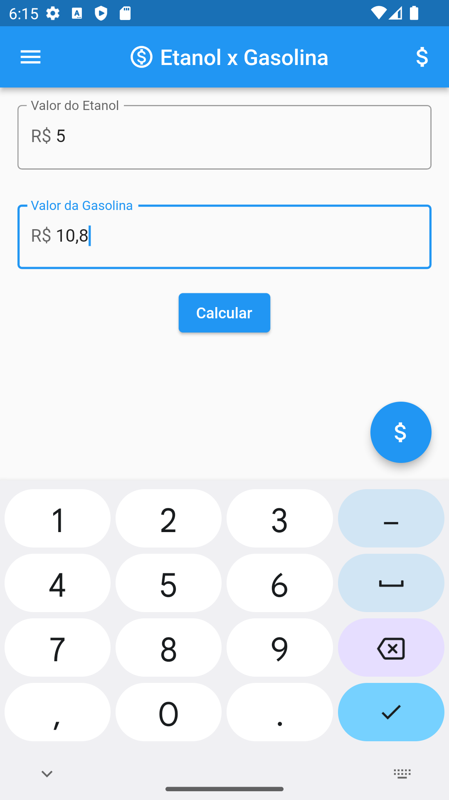
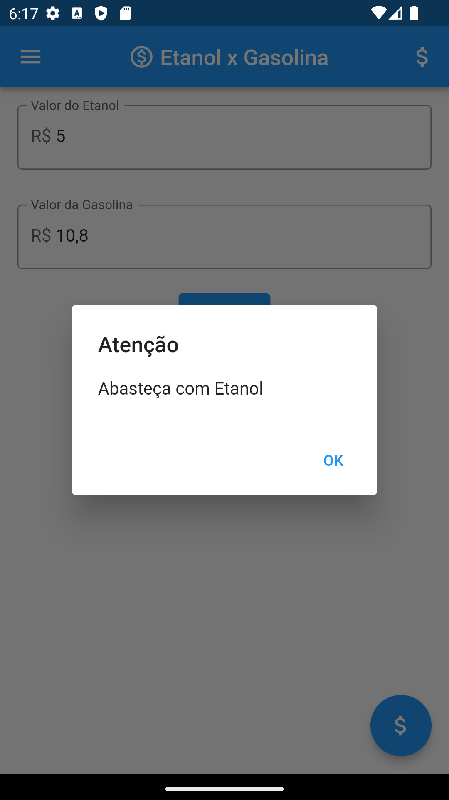

# Projeto - App com Flutter - UniAlfa 

Projeto desenvolvido na aula de desenvolvimento Mobile com Flutter, para fins didáticos.

Visualização do App                                                                                                

